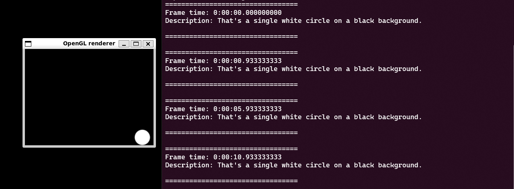
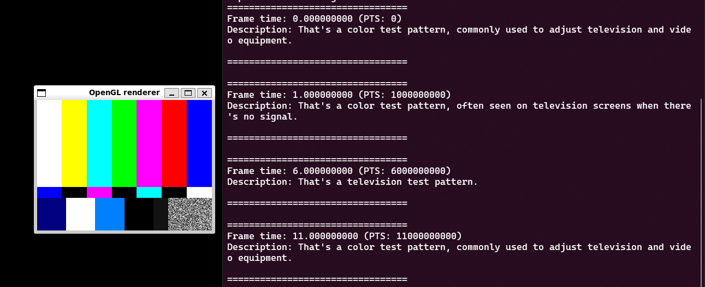

<div id="top"></div>
<br/>
<br/>
<br/>


<p align="center">
  
</p>
<h1 align="center">
    <a href="https://github.com/Armaggheddon/GstGeminiVision">GstGeminiVision</a>
</h1>
<p align="center">
    <a href="https://github.com/Armaggheddon/GstGeminiVision/commits/master">
    
    </a>
    <a href="https://github.com/Armaggheddon/GstGeminiVision">
    
    </a>
    <a href="https://github.com/Armaggheddon/GstGeminiVision/issues">
    
    </a>
    <a href="https://github.com/Armaggheddon/GstGeminiVision/blob/master/LICENSE">
    
    </a>
</p>
<p align="center">
    Transform your media pipelines with AI-powered insights! 🎥🤖
    <br/>
    <br/>
    <a href="https://github.com/Armaggheddon/GstGeminiVision/issues">Report Bug</a>
    •
    <a href="https://github.com/Armaggheddon//issues">Request Feature</a>
</p>

---

Ever wondered what a GStreamer pipeline would say if it could talk? Now it can (almost)! With **GstGeminiVision**, you can inject the power of Google's Gemini Vision API directly into your GStreamer media pipelines. Turn your video streams into insightful descriptions, automate content analysis, or just have some fun making your videos self-aware! 🤖🎬

<video src="./docs/gemini_vision_demo.mp4" width="800" height="213" controls autoplay loop></video>

---


## 🤨 What is GstGeminiVision?

GstGeminiVision is a GStreamer plugin that acts as a bridge between your live video or image streams and the Google Gemini Vision API. It periodically captures frames, sends them to Gemini for analysis based on your prompt, and then makes the generated description available either as GStreamer metadata or through a GObject signal.

Imagine:
*   Generating visual descriptions for accessibility purposes.
*   Creating a security camera that describes what it sees.
*   Building interactive art installations that react to visual input.
*   ...the possibilities are as vast as your imagination (and Gemini's capabilities)!


---

## 🌟 Features

- **Seamless GStreamer Integration:** Works like any other GStreamer element.
- **Google Gemini Power:** Leverages the advanced multimodal capabilities of the Gemini API.
- **Configurable Analysis:**
    - Set your own **API Key**.
    - Craft custom **prompts** to guide Gemini's analysis.
    - Choose your preferred Gemini **model** (e.g., `gemini-2.0-flash`).
    - Control the **analysis interval**.
    - Fine-tune **generation parameters** (temperature, max tokens, top-P, top-K, stop sequences).
- **Flexible Output:**
    - Receive descriptions via a GObject **signal** (`description-received`).
    - Embed descriptions directly into the GStreamer buffer as **metadata** (GstGeminiDescriptionMeta).
- **Asynchronous Processing:** API calls are handled in a separate thread to keep your pipeline flowing smoothly.
- **Example Applications:** Comes with C and Python examples to get you started quickly.
- **Dockerized Environment:** Includes a Dockerfile for easy building and testing.

---

## 🎬 See it in Action!

*   Show a `videotestsrc` pipeline running with the plugin.
*   Display the console output from `example.py` or `gemini_vision_example.c` showing the descriptions.
*   *Bonus:* If you have a more complex demo (e.g., overlaying text on video), showcase that!




```bash
gst-launch-1.0 videotestsrc ! videoconvert ! geminivision api-key="YOUR_KEY" prompt="What is this?" ! fakesink
```
```console
Setting pipeline to PLAYING state...
Pipeline running...
Press Ctrl+C to quit
Pipeline state changed from NULL to READY
Pipeline state changed from READY to PAUSED
Pipeline state changed from PAUSED to PLAYING

=================================
Frame time: 0.000000000 (PTS: 0)
Description: That's a color bars test pattern, used to adjust color settings on television screens.

=================================

^CInterrupt received, stopping...
Cleaning up...
Pipeline stopped.
Cleaning up...
Pipeline stopped.
```

---

## 🛠️ Getting Started

Ready to give your GStreamer pipelines a voice? Let's go!

### Prerequisites

- **GStreamer:** Core GStreamer libraries and development files (version 1.16+ recommended).
- **Build Tools:** `meson`, `ninja`, `gcc` (or your C compiler), `pkg-config`.
- **Dependencies for the Plugin:**
    - `libglib2.0-dev`
    - `libgstreamer-plugins-base1.0-dev`
    - `libcurl4-openssl-dev` (or your system's cURL dev package)
    - `libjson-c-dev`
    - `libjpeg-dev`
    - `libgirepository1.0-dev` & `gobject-introspection` (for GObject Introspection, used by Python example)
- **Python 3** (for the Python example):
    - `python3-gi`
    - `python3-gst-1.0`
- **A Google Gemini API Key:** Get yours from the [Google AI Studio](https://aistudio.google.com/apikey).

### Building the Plugin

1.  **Clone the repository (if you haven't already):**
    ```bash
    git clone https://github.com/Armaggheddon/GstGeminiVision.git
    cd GstGeminiVision
    ```

2.  **Navigate to the plugin directory:**
    ```bash
    cd gst-gemini-plugin
    ```

3.  **Configure and build with Meson & Ninja:**
    First, set up the build directory using Meson. The `--prefix=/usr` ensures that a subsequent install places files in standard system locations.
    ```bash
    meson setup build --prefix=/usr --buildtype=release --wipe
    ```
    Then, compile the plugin:
    ```bash
    ninja -C build
    ```
    Your compiled plugin shared object (e.g., `libgstgeminivision.so`) will be located in the `gst-gemini-plugin/build/src/` directory (or similar, depending on your Meson structure).

4.  **Install the Plugin (Optional, but Recommended for System-Wide Access):**
    To make the plugin and its development files available system-wide, run the install command (this usually requires root privileges):
    ```bash
    sudo ninja -C build install
    ```
    This command will copy the necessary files to standard system locations. Based on a typical installation with `--prefix=/usr`, the files will be placed as follows:
    *   The plugin library: `libgstgeminivision.so` to `/usr/lib/x86_64-linux-gnu/gstreamer-1.0/`
    *   GObject Introspection data:
        *   `GstGeminiVision-1.0.gir` to `/usr/share/gir-1.0/`
        *   `GstGeminiVision-1.0.typelib` to `/usr/lib/x86_64-linux-gnu/girepository-1.0/`
    *   Pkg-config file: `gstgeminivision.pc` (or similar) to `/usr/lib/x86_64-linux-gnu/pkgconfig/`

    *(Note: The exact paths like `x86_64-linux-gnu` might vary slightly based on your Linux distribution's multiarch setup. The `--prefix` you used with `meson setup` determines the base for these paths.)*

    After installation, GStreamer should be able to automatically discover the plugin. You might need to clear GStreamer's cache if it doesn't pick it up immediately (though `ninja install` often triggers this).

### Running the Examples

Make sure GStreamer can find your newly built plugin. You can either install it system-wide (`sudo ninja -C build install` - requires Meson install target to be configured) or, more easily for development, set the `GST_PLUGIN_PATH`:

```bash
export GST_PLUGIN_PATH=$(pwd)/gst-gemini-plugin/build:$GST_PLUGIN_PATH
# For Python introspection (if not installed system-wide):
export GI_TYPELIB_PATH=$(pwd)/gst-gemini-plugin/build:$GI_TYPELIB_PATH
```

And don't forget your API key!
```bash
export GST_GEMINI_API_KEY="YOUR_API_KEY"
```
Or by prepending it when running the examples as `GST_GEMINI_API_KEY="YOUR_API_KEY" ./example.py`.

### C Example
Navigate to the examples directory and compile/run:
```bash
cd examples
gcc gemini_vision_example.c -o gemini_vision_example $(pkg-config --cflags --libs gstreamer-1.0 glib-2.0 gobject-2.0)
./gemini_vision_example
```
or
```bash
gcc gemini_vision_example.c -o gemini_vision_example $(pkg-config --cflags --libs gstreamer-1.0 glib-2.0 gobject-2.0)
```

### Python Example
Navigate to the examples directory and run:
```bash
cd examples
python3 example.py
```

You should see descriptions from Gemini printed to the console! 🚀

---

## 🐳 Docker: Your AI-Powered Media Lab in a Box!

Want to dive straight into the action without wrestling with dependencies? Our Docker setup is your golden ticket! 🎟️ It's like having a pre-configured media lab, ready to build, test, and run GstGeminiVision with just a few commands. No more "it works on my machine" – it'll work in *this* machine!

**Step 1: Build the All-Powerful Docker Image**

First, conjure up your Docker image. This image contains all the tools and magic needed. From your `GstGeminiVision` project root:
```bash
docker build -t gst-gemini-vision .
```
*(Psst! If you've already built it, you can skip this step unless you've made changes to the Dockerfile or the plugin build process itself.)*

**Step 2: Unleash the Entrypoint Script!**

The Docker image comes with a super-handy `entrypoint.sh` script that acts as your mission control. You tell it what to do, and it handles the nitty-gritty. Here are your commands, Captain:

- **`build` (Default Action): Compile the Mighty Plugin!**
    Just want to build the main `geminivision` plugin? This is your command. It compiles the plugin but doesn't install it system-wide in the container. Perfect for a quick compilation check.
    ```bash
    # Run from your GstGeminiVision project root
    docker run --rm \
        --volume $(pwd)/gst-gemini-plugin:/builder \
        gst-gemini-vision build
    ```

- **`build-examples`: Build the Plugin & The Examples!**
    This action first ensures the main `geminivision` plugin is built and installed *inside the container*. Then, it gallops over to your examples directory (`/examples` in the container) and builds them (either using the Makefile or compiling C files directly).
    ```bash
    # Run from your GstGeminiVision project root
    docker run --rm \
        --volume $(pwd)/gst-gemini-plugin:/builder \
        --volume $(pwd)/examples:/examples \
        gst-gemini-vision build-examples
    ```

- **`test-examples <example_script_name>`: The Grand Showcase!**
    This is where the real fun begins! This action:
    1.  If you specify a C example (e.g., `gemini_vision_example.c`), it compiles it on the fly if not already built.
    1.  Runs your chosen example script (C or Python)!
    ✨ **Requires `GST_GEMINI_API_KEY`!** ✨
    ```bash
    # Example for the C script (gemini_vision_example.c):
    # Run from your GstGeminiVision project root
    docker run --rm \
        -e GST_GEMINI_API_KEY="YOUR_ACTUAL_API_KEY" \
        -e DISPLAY=$DISPLAY -v /tmp/.X11-unix:/tmp/.X11-unix \
        --volume $(pwd)/gst-gemini-plugin:/builder \
        --volume $(pwd)/examples:/examples \
        gst-gemini-vision test-examples gemini_vision_example.c

    # Example for the Python script (gemini_vision_example.py):
    # Run from your GstGeminiVision project root
    docker run --rm \
        -e GST_GEMINI_API_KEY="YOUR_ACTUAL_API_KEY" \
        -e DISPLAY=$DISPLAY -v /tmp/.X11-unix:/tmp/.X11-unix \
        --volume $(pwd)/gst-gemini-plugin:/builder \
        --volume $(pwd)/examples:/examples \
        gst-gemini-vision test-examples gemini_vision_example.py
    ```
    Don't forget to replace `"YOUR_ACTUAL_API_KEY"`! The X11 forwarding lines are for examples that pop up a video window.

- **`shell`: Your Personal Command Deck!**
    Want to poke around inside the container? Need to run some custom commands or debug something? The `shell` action drops you right into an interactive command line.
    ```bash
    # Run from your GstGeminiVision project root
    docker run -it --rm \
        -e GST_GEMINI_API_KEY="YOUR_ACTUAL_API_KEY" `# Optional, but good to have if you plan to test` \
        -e DISPLAY=$DISPLAY -v /tmp/.X11-unix:/tmp/.X1_unix \
        --volume $(pwd)/gst-gemini-plugin:/builder \
        --volume $(pwd)/examples:/examples \
        gst-gemini-vision shell
    ```
    Inside the shell, your plugin source will be at `/builder` and examples at `/examples`. The main plugin won't be installed by default with this action alone, but the `entrypoint.sh` script itself is available at `/entrypoint.sh` if you want to manually trigger parts of its logic, or use this shell after running `test-examples` to inspect a fully set-up environment.

> [!NOTE]
> Using `-e DISPLAY=$DISPLAY -v /tmp/.X11-unix:/tmp/.X11-unix` allows GUI elements to display on your host machine. This requires running the command `xhost +` on your host Linux machine to allow the Docker container to access your display. If you're using a different display server or setup, you might need to adjust these flags accordingly.

**Important Notes for Docker Adventures:**
- **Volume Mounts are Key:** The `--volume $(pwd)/...:/...` flags map directories from your computer into the Docker container.
    - `/builder`: Points to your `gst-gemini-plugin` directory. This is where the main plugin source code lives.
    - `/examples`: Points to your `examples` directory.
- **API Key:** For `test-examples`, the `GST_GEMINI_API_KEY` environment variable (`-e`) is crucial. The plugin won't talk to Google without it!
- **GUI Display:** If your examples use `autovideosink` or any other element that creates a window, you'll need the `-e DISPLAY=$DISPLAY -v /tmp/.X11-unix:/tmp/.X11-unix` lines (and sometimes `xhost +local:docker` on your host Linux machine) to see the output.

With these commands, you're all set to explore the wonders of GstGeminiVision without breaking a sweat over setup!

---

## ⚙️ Configuration (Plugin Properties)

The `geminivision` element has several properties you can configure. For a **full, detailed list** of all properties, their types, default values, ranges, and descriptions, please refer to the output of `gst-inspect-1.0`:

➡️ **[View Full Plugin Details (gst-inspect-1.0 output)](docs/gst_inspect_geminivision.txt)** ⬅️

You can also generate this information yourself by running:
```bash
gst-inspect-1.0 geminivision
```

Here's a summary of the key properties:

- `api-key` (string): Your Google Gemini API Key (Mandatory!).
- `prompt` (string): The text prompt to guide Gemini's analysis. Default: "Describe what you see in this image".
- `model-name` (string): The Gemini model to use. Default: "gemini-2.0-flash-latest".
- `analysis-interval` (double): Time in seconds between analyses. Default: 5.0.
- `output-metadata` (boolean): If TRUE, output description as GstMeta. If FALSE (default), emit a signal.
- **Generation Config**:
    - `stop-sequences` (GStrv/list of strings): Sequences where the API will stop generating.
    - `temperature` (double): Controls randomness (0.0-2.0). Default: 1.0.
    - `max-output-tokens` (int): Max tokens to generate. Default: 800.
    - `top-p` (double): Nucleus sampling probability. Default: 0.8.
    - `top-k` (int): Sample from the K most likely tokens. Default: 10.

You can set these using `gst-launch-1.0` or programmatically in your C/Python applications.

Example with `gst-launch-1.0`:
```bash
gst-launch-1.0 videotestsrc pattern=ball ! videoconvert ! \
    geminivision api-key="$GST_GEMINI_API_KEY" \
                   prompt="Is there a ball in this image? Answer yes or no." \
                   output-metadata=false \
                   temperature=0.2 \
! videoconvert ! autovideosink
```

## 🙌 Contributing
Contributions are welcome! Whether it's bug fixes, new features, or documentation improvements, feel free to open an issue or submit a pull request.


## 📜 License
This project is licensed under the MIT License - see the LICENSE.md file for details.

--- 

Happy Hacking and may your pipelines be ever insightful! 💡
